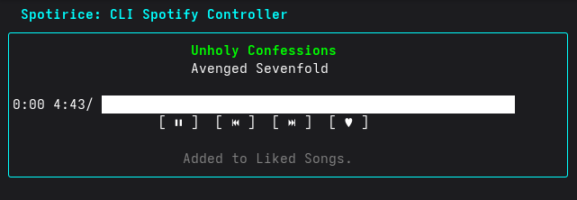

# Spotirice

[](https://github.com/metolius25/spotirice/releases)
[](https://opensource.org/licenses/MIT)

A lightweight, ricing‑friendly terminal interface for controlling Spotify. Spotirice is written in **Go** and built with the [Bubble Tea](https://github.com/charmbracelet/bubbletea) TUI framework along with [Lip Gloss](https://github.com/charmbracelet/lipgloss) for styling and the [Spotify Web API](https://github.com/zmb3/spotify) client. It gives you quick access to playback controls, track information and your liked songs within your terminal.





## Controls
While you can actually click on the buttons too, here are the assigned keybindings:

| Key / Button | Action |
|------------------|-------------------------------------------|
| `p` or `Space`   | Toggle play/pause |
| `n`              | Skip to the next track |
| `b`              | Go back to the previous track |
| `l`              | Add to/remove from liked songs |
| `+` or `=`       | Volume up (+10%) |
| `-` or `_`       | Volume down (-10%) |
| `←` / `→`        | Seek backward/forward 10 seconds |
| `s` or `/`       | Search for songs |
| `?`              | Show/hide help screen |
| `q` or `Ctrl+C`  | Quit Spotirice |


> **Note**: An instance of Spotify must be running on a device connected to your authorized account. If no device is found, Spotirice will attempt to launch Spotify automatically.

### Installation


1. **Clone the repository** and build the binary*:


```sh
git clone https://github.com/metolius25/spotirice.git
cd spotirice
go build -o spotirice ./...
```
* Refer to [release.yml] for appropriate build flags.

Alternatively, you can install it directly into your `$GOBIN`:


```sh
go install github.com/metolius25/spotirice@latest
```


2. **Create your configuration directory**:


```sh
mkdir -p ~/.config/spotirice
```


3. *(Optional)* **Customise colours** by creating a `config.toml` in the same directory. The file overrides the default hex colours used in the UI. Example:


```toml
# ~/.config/spotirice/config.toml
header = "#00ffff" # cyan
track_playing = "#00ff00" # green
track_paused = "#ffff00" # yellow
artist = "#ffffff" # white
progress_bar = "#00ffff" # cyan
status = "#808080" # grey
error = "#ff0000" # red
```


# Roadmap
- Like/unlike songs ✅
- Volume control ✅
- Seek within track ✅
- Help screen ✅
- Auto-launch Spotify ✅
- Cross-platform support (Linux, macOS, Windows) ✅
- Song search ✅
- Playlist search 🔲
- Edit song queue 🔲
- Playing device selector 🔲
  


This project is licensed under the MIT License. See the [LICENSE](LICENSE) file for details.

